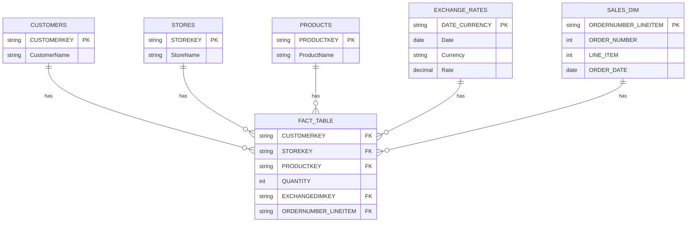

# GLOBAL ELECTRONIC RETAILS ANALYSIS SNOWFLAKE

## Introduction

Welcome to the `GLOBAL ELECTRONIC RETAILS ANALYSIS SNOWFLAKE` project documentation! This project is designed to facilitate the analysis of global electronic retail data by leveraging the power of Snowflake as a cloud data warehousing platform and Python for efficient data ingestion and processing.

The primary goal of this initiative is to provide a robust and scalable solution for storing, transforming, and querying electronic retail datasets, enabling comprehensive business intelligence and analytical insights.


## Table of Contents 

1.  [Introduction](#introduction)
2.  [Project Overview](#project-overview)
3.  [Project Structure](#project-structure)
4.  [Getting Started](#getting-started)
    *   [Prerequisites](#prerequisites)
    *   [Installation](#installation)
    *   [Configuration](#configuration)
    *   [Running the Project](#running-the-project)
5.  [Key Features](#key-features)
6.  [Documentation](#documentation)
7.  [Glossary of Terms](#glossary-of-terms)
8.  [References](#references)

## Project Overview

This project establishes a data pipeline and modeling framework within Snowflake for global electronic retail data. It includes:

*   **Data Ingestion:** A Python script (`main.py`) to load raw data from CSV files into Snowflake.
*   **Data Modeling:** SQL scripts (`main.sql`) to define the Snowflake schema, create unique keys, and build optimized fact and dimension tables for analytical purposes.


## Project Structure

The repository is organized to clearly separate concerns:

*   `main.py`: Contains the Python script responsible for connecting to Snowflake and ingesting data from CSV files into the designated Snowflake tables.
*   `main.sql`: Contains the SQL DDL (Data Definition Language) and DML (Data Manipulation Language) statements for setting up the Snowflake database, schema, creating unique keys, and defining the `FACT_TABLE` and `SALES_DIM` for analytical querying.
*   `/docs`: (Proposed) This directory will house more detailed documentation, including architectural diagrams, in-depth setup guides, and explanations of the data models.

## Data Model (ERD)

The following Entity-Relationship Diagram illustrates the relationships between the tables in the `GER2` schema, showcasing the star schema design with `FACT_TABLE` at its center.



**Explanation of Relationships:**

*   **`CUSTOMERS` -- `FACT_TABLE`**: The `FACT_TABLE` contains `CUSTOMERKEY` as a foreign key, linking each sales fact to a specific customer in the `CUSTOMERS` dimension table.
*   **`STORES` -- `FACT_TABLE`**: The `FACT_TABLE` contains `STOREKEY` as a foreign key, linking each sales fact to the store where the transaction occurred in the `STORES` dimension table.
*   **`PRODUCTS` -- `FACT_TABLE`**: The `FACT_TABLE` contains `PRODUCTKEY` as a foreign key, linking each sales fact to the specific product sold in the `PRODUCTS` dimension table.
*   **`EXCHANGE_RATES` -- `FACT_TABLE`**: The `FACT_TABLE` contains `EXCHANGEDIMKEY` (which corresponds to `DATE_CURRENCY`) as a foreign key, linking each sales fact to the relevant exchange rate information in the `EXCHANGE_RATES` table.
*   **`SALES_DIM` -- `FACT_TABLE`**: The `FACT_TABLE` contains `ORDERNUMBER_LINEITEM` as a foreign key, linking each sales fact to its detailed line item information in the `SALES_DIM` table.
*   **`SALES` (Source Table)**: The `SALES` table serves as the primary source for both the `FACT_TABLE` (after joining with `EXCHANGE_RATES`) and the `SALES_DIM` table. It holds the initial raw transactional data before the final star schema structure is formed.


## Getting Started

This section provides a high-level overview of how to set up and run the project. For detailed, step-by-step instructions, please refer to the dedicated documentation files listed in the [Documentation](#documentation) section.

### Prerequisites

Before you begin, ensure you have the following:

*   **Python 3.x:** Installed on your local machine.
*   **Snowflake Account:** Access to a Snowflake account with appropriate permissions to create databases, schemas, tables, and load data.
*   **Snowflake Credentials:** Your Snowflake username, password, account identifier, warehouse, database, schema, and role.
*   **CSV Data Files:** The raw electronic retail data in CSV format, ready for ingestion.

### Installation

1.  **Clone the Repository:**
    ```bash
    git clone <repository_url>
    cd GLB_ELEC_RET
    ```
2.  **Install Python Dependencies:**
    It is recommended to use a virtual environment.
    ```bash
    python -m venv venv
    source venv/bin/activate # On Windows use `venv\Scripts\activate`
    pip install pandas snowflake-connector-python
    ```

### Configuration

The `main.py` script requires Snowflake connection details. These are currently placeholders in the script. **Before running, you must update the following variables in `main.py` with your actual Snowflake credentials:**

```python
SNOWFLAKE_USER = "YOUR_SNOWFLAKE_USER"
SNOWFLAKE_PASSWORD = "YOUR_SNOWFLAKE_PASSWORD"
SNOWFLAKE_ACCOUNT = "YOUR_SNOWFLAKE_ACCOUNT"
SNOWFLAKE_WAREHOUSE = "YOUR_SNOWFLAKE_WAREHOUSE"
SNOWFLAKE_DATABASE = "YOUR_SNOWFLAKE_DATABASE"
SNOWFLAKE_SCHEMA = "YOUR_SNOWFLAKE_SCHEMA"
SNOWFLAKE_ROLE = "YOUR_SNOWFLAKE_ROLE"
```

Additionally, update the `df = pd.read_csv(r"PATH")` line in `main.py` to point to the actual path of your CSV data file.

### Running the Project

1.  **Set up Snowflake Schema and Tables:**
    Execute the SQL commands in `main.sql` within your Snowflake environment (e.g., via Snowsight, SnowSQL, or a SQL client). This will create the necessary database, schema, and initial tables (`CUSTOMERS`, `EXCHANGE_RATES`, `PRODUCTS`, `SALES`, `STORES`) and define the unique keys.

    *Example (using SnowSQL):*
    ```bash
    snowsql -f main.sql
    ```

2.  **Ingest Data:**
    Run the Python script to load your CSV data into Snowflake.
    ```bash
    python main.py
    ```
    This script will connect to Snowflake and ingest the data from your specified CSV file into the `NEW_FILE_NAME` table (or whatever you set `table_name` to in `main.py`).

3.  **Perform Data Modeling (if not already done by `main.sql`):**
    After ingestion, the `main.sql` script also contains commands to create the `FACT_TABLE` and `SALES_DIM` by joining and transforming the raw ingested data. Ensure these commands are executed to complete the data modeling process.

## Key Features

*   **Automated Data Ingestion:** Seamlessly load CSV data into Snowflake using a Python-based ingestion script, leveraging the `snowflake-connector-python` library for efficient data transfer.
*   **Robust Data Modeling:** Implement a dimensional data model within Snowflake, featuring a central `FACT_TABLE` and a `SALES_DIM` table. This design supports efficient querying and complex analytical operations.
*   **Unique Key Generation:** SQL logic is provided to generate unique keys (`DATE_CURRENCY`, `ORDERDATE_CURRENCY`, `ORDERNUMBER_LINEITEM`) to facilitate accurate joins and data integrity across tables.
*   **Scalable Data Platform:** Built on Snowflake, the solution offers high performance, scalability, and elasticity for handling large volumes of retail data.

## Documentation

This README serves as a high-level entry point. For more detailed information, please refer to the following documentation (to be located in the `/docs` directory):

*   **Architectural Overview**: A comprehensive guide to the system's architecture, components, and data flow.
*   **Data Ingestion Guide**: Detailed instructions and troubleshooting for the `main.py` data ingestion process.
*   **Data Modeling Guide**: In-depth explanation of the Snowflake data model, including table schemas, relationships, and unique key definitions.
*   **Development Guide**: Guidelines for contributing to the project, setting up development environments, and testing.

## Glossary of Terms

*   **Snowflake**: A cloud-based data warehousing platform known for its scalability, performance, and elasticity.
*   **Fact Table**: In a dimensional data model, a central table that stores quantitative measures (e.g., `QUANTITY`, `SALES_AMOUNT`) and foreign keys to dimension tables. It typically represents business events or transactions.
*   **Dimension Table**: In a dimensional data model, a companion table to a fact table that contains descriptive attributes (e.g., `CUSTOMERS`, `PRODUCTS`, `STORES`, `DATES`). These tables provide context for the measures in the fact table.
*   **Data Ingestion**: The process of importing raw data from various source systems into a data storage system or database, often as a preliminary step before transformation and analysis.
*   **`write_pandas`**: A function provided by the `snowflake-connector-python` library that facilitates efficient bulk loading of pandas DataFrames directly into Snowflake tables.
*   **DDL (Data Definition Language)**: A subset of SQL commands used to define, create, and modify the structure of database objects such as tables, schemas, and databases (e.g., `CREATE TABLE`, `ALTER TABLE`, `DROP SCHEMA`).
*   **DML (Data Manipulation Language)**: A subset of SQL commands used to manage and manipulate data within database objects (e.g., `INSERT`, `UPDATE`, `DELETE`, `SELECT`).
*   **Unique Key**: A column or set of columns in a table that uniquely identifies each record in that table. It ensures data integrity and is often used for joining tables.

## References

*   `main.py`: Python script for data ingestion.
*   `main.sql`: SQL script for Snowflake schema, table creation, and data modeling.
