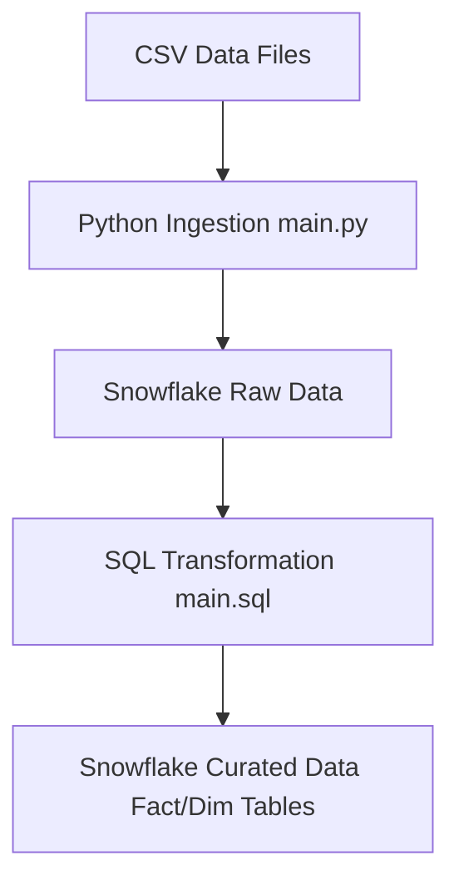

# Global Electronic Retails Analysis Snowflake: Architectural Overview

## Introduction

This document provides a high-level architectural overview of the "Global Electronic Retails Analysis Snowflake" project. The primary goal of this system is to ingest, store, and transform retail sales and related data into a structured format within Snowflake for analytical purposes. This document outlines the key components, their responsibilities, and the flow of data through the system.

## Table of Contents

1.  [Introduction](#introduction)
2.  [Table of Contents](#table-of-contents)
3.  [System Components](#system-components)
    *   [Data Source](#data-source)
    *   [Data Ingestion Layer](#data-ingestion-layer)
    *   [Data Warehouse](#data-warehouse)
    *   [Data Transformation Layer](#data-transformation-layer)
    *   [Consumption Layer](#consumption-layer)
4.  [Data Flow](#data-flow)
5.  [Architectural Diagram](#architectural-diagram)
6.  [Glossary of Terms](#glossary-of-terms)
7.  [References](#references)

## System Components

The architecture of the Global Electronic Retails Analysis system is designed around a modern cloud data warehousing approach, leveraging Snowflake as its core.

### Data Source

The initial data for this project originates from Comma Separated Values (CSV) files. These files are assumed to contain various datasets relevant to retail operations, such as customer information, product details, sales transactions, store data, and exchange rates. The exact structure and content of these CSV files are inferred by the Python ingestion script which reads them.

### Data Ingestion Layer

The data ingestion layer is responsible for loading the raw data from the CSV files into the Snowflake data warehouse.

*   **Component:** `main.py` (Python script)
*   **Functionality:**
    *   Reads CSV files using the Pandas library.
    *   Establishes a connection to Snowflake using `snowflake.connector`.
    *   Utilizes `snowflake.connector.pandas_tools.write_pandas` to efficiently upload Pandas DataFrames directly into Snowflake tables.
    *   Automatically creates the target table in Snowflake if it does not already exist, based on the DataFrame schema.
*   **Purpose:** Provides a robust and automated mechanism for transferring external data into the raw layer of the Snowflake data warehouse.

### Data Warehouse

Snowflake serves as the central cloud-based data warehouse for this project, providing scalable storage and compute capabilities.

*   **Component:** Snowflake Data Warehouse
*   **Database:** `GLB_ELEC_RETS`
*   **Schema:** `GER2`
*   **Functionality:**
    *   Stores raw data ingested from CSV files (e.g., `CUSTOMERS`, `EXCHANGE_RATES`, `PRODUCTS`, `SALES`, `STORES` tables).
    *   Hosts transformed and curated data in the form of fact and dimension tables, optimized for analytical queries.
*   **Purpose:** Acts as the single source of truth for all retail analysis data, supporting both raw data storage and analytical data models.

### Data Transformation Layer

This layer is responsible for transforming the raw data within Snowflake into a structured and optimized format suitable for business intelligence and analytical reporting.

*   **Component:** `main.sql` (Snowflake SQL script)
*   **Functionality:**
    *   Creates unique keys by concatenating and hashing existing columns in raw tables (e.g., `DATE_CURRENCY` in `EXCHANGE_RATES`, `ORDERDATE_CURRENCY` and `ORDERNUMBER_LINEITEM` in `SALES`).
    *   Constructs a `FACT_TABLE` by joining the `SALES` table with `EXCHANGE_RATES`, linking transactional data with relevant dimensions.
    *   Creates a `SALES_DIM` (Sales Dimension) table, extracting key sales order details for dimensional modeling.
*   **Purpose:** Converts raw, operational data into a star schema or similar denormalized structure, enhancing query performance and simplifying data analysis.

### Consumption Layer

While not explicitly detailed in the provided code, the consumption layer represents the interface through which end-users and analytical tools access the transformed data for insights and reporting.

*   **Component:** (Implied) Business Intelligence (BI) tools, analytical dashboards, reporting applications, or direct SQL query clients.
*   **Functionality:** Connects to the Snowflake data warehouse (specifically the curated `FACT_TABLE` and dimension tables) to perform ad-hoc queries, generate reports, and visualize data.
*   **Purpose:** Enables data-driven decision-making by providing actionable insights from the processed retail data.

## Data Flow

The data flows through the system in a sequential manner, undergoing various stages of processing and transformation:

1.  **Data Source (CSV Files):** Raw retail data is initially available in local CSV files.
2.  **Data Ingestion (`main.py`):** The Python script `main.py` reads these CSV files and establishes a connection to Snowflake. It then uses the `write_pandas` utility to efficiently load the data into designated raw tables within the `GLB_ELEC_RETS.GER2` schema in Snowflake.
3.  **Snowflake Raw Data:** Once ingested, the data resides in its raw form within Snowflake tables (e.g., `CUSTOMERS`, `EXCHANGE_RATES`, `PRODUCTS`, `SALES`, `STORES`).
4.  **Data Transformation (`main.sql`):** The `main.sql` script is executed within Snowflake. This script performs data cleaning, standardization, creation of unique keys, and the construction of analytical `FACT_TABLE` and `SALES_DIM` tables, optimizing the data for querying.
5.  **Snowflake Curated Data (Fact/Dimension Tables):** The transformed and optimized data is stored in the `GLB_ELEC_RETS.GER2` schema, ready for consumption by analytical tools.

## Architectural Diagram

The following diagram illustrates the high-level data flow and system components:

## Glossary of Terms

*   **CSV (Comma Separated Values):** A plain text file format for storing tabular data, where each line is a data record and each record consists of one or more fields, separated by commas.
*   **Data Warehouse:** A large repository of data collected from various sources within an organization, used for reporting and data analysis.
*   **Dimension Table:** In a data warehouse, a table that describes the business entities of an enterprise (e.g., Customers, Products, Stores). They contain descriptive attributes.
*   **Fact Table:** In a data warehouse, a central table that contains the primary keys of dimension tables and quantitative measures (facts) about a business process (e.g., Sales quantity, Revenue).
*   **Pandas:** A fast, powerful, flexible, and easy-to-use open-source data analysis and manipulation tool, built on top of the Python programming language.
*   **Python:** A popular high-level, general-purpose programming language often used for data processing, scripting, and web development.
*   **Snowflake:** A cloud-based data warehousing platform that provides a data warehouse as a service.
*   **SQL (Structured Query Language):** A standard language for managing and manipulating relational databases.

## References

*   `C:\Users\6135532\OneDrive - Thomson Reuters Incorporated\Desktop\ClarityForge & COAL\Clarity Forge\(Interactively Created Documentations)\GLB_ELEC_RET\README.md`
*   `C:\Users\6135532\OneDrive - Thomson Reuters Incorporated\Desktop\ClarityForge & COAL\Clarity Forge\(Interactively Created Documentations)\GLB_ELEC_RET\main.py`
*   `C:\Users\6135532\OneDrive - Thomson Reuters Incorporated\Desktop\ClarityForge & COAL\Clarity Forge\(Interactively Created Documentations)\GLB_ELEC_RET\main.sql`