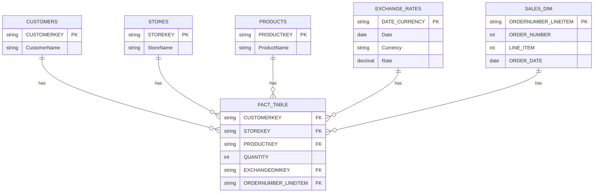

# Data Modeling and Transformation Guide for Global Electronic Retails Analysis

## Introduction

This document provides a detailed guide to the data modeling and transformation processes within the "GLOBAL ELECTRONIC RETAILS ANALYSIS SNOWFLAKE" project. The core of this process is the `main.sql` script, which orchestrates the setup of the Snowflake environment, defines the initial data structures, and performs crucial transformations to convert raw operational data into a structured format suitable for analytical purposes. This transformation culminates in the creation of optimized fact and dimension tables, forming a robust star schema within Snowflake.

## Table of Contents

1.  [Database and Schema Setup](#database-and-schema-setup)
2.  [Source Tables Overview](#source-tables-overview)
3.  [Data Preparation and Key Generation](#data-preparation-and-key-generation)
4.  [Fact and Dimension Tables](#fact-and-dimension-tables)
    *   [FACT_TABLE](#fact_table)
    *   [SALES_DIM](#sales_dim)
5.  [Data Model (ERD)](#data-model-erd)
6.  [Glossary of Terms](#glossary-of-terms)
7.  [References](#references)

## 1. Database and Schema Setup

The `main.sql` script begins by establishing the foundational environment in Snowflake.

*   **`USE DATABASE GLB_ELEC_RETS;`**: This command sets the active database to `GLB_ELEC_RETS`. All subsequent operations, such as schema creation and table manipulation, are performed within the context of this database.
*   **`CREATE SCHEMA GER2;`**: A new schema named `GER2` is created within the `GLB_ELEC_RETS` database. Schemas serve as logical containers for database objects like tables, views, and stored procedures, helping to organize data and manage access.
*   **`USE SCHEMA GER2;`**: This command sets `GER2` as the active schema, meaning all table operations will implicitly refer to objects within this schema unless explicitly qualified.

## 2. Source Tables Overview

The project leverages several initial tables that serve as the raw data sources. The `main.sql` script includes `DESC TABLE` and `SELECT * FROM` statements for these tables, indicating their presence and structure as starting points for the data model. While their full schemas are not explicitly defined in `main.sql`, their names and typical uses imply their purpose:

*   **`CUSTOMERS`**: This table likely contains information about individual customers, such as customer names, addresses, and other demographic data. It is expected to include a `CUSTOMERKEY` column serving as its primary identifier.
*   **`EXCHANGE_RATES`**: This table stores daily or periodic exchange rates between different currencies. Key columns would include `DATE`, `CURRENCY`, and `RATE`. It is crucial for converting sales figures across different currencies.
*   **`PRODUCTS`**: This table holds details about the products sold, such as product names, categories, and pricing information. It is expected to include a `PRODUCTKEY` column as its primary identifier.
*   **`SALES`**: This is the primary transactional table, containing individual sales records. It includes details such as `ORDER_NUMBER`, `LINE_ITEM`, `ORDER_DATE`, `CURRENCY_CODE`, `QUANTITY`, and foreign keys (`CUSTOMERKEY`, `STOREKEY`, `PRODUCTKEY`) linking to other dimension tables. This table undergoes significant transformation.
*   **`STORES`**: This table provides information about the retail stores, such as store names, locations, and other operational details. It is expected to include a `STOREKEY` column as its primary identifier.

## 3. Data Preparation and Key Generation

A critical step in the data transformation process involves enriching the `EXCHANGE_RATES` and `SALES` tables by adding new columns that serve as unique keys or facilitate efficient joins.

*   **`EXCHANGE_RATES` - `DATE_CURRENCY` Key**:
    *   `ALTER TABLE EXCHANGE_RATES ADD COLUMN DATE_CURRENCY STRING;`
    *   `UPDATE EXCHANGE_RATES SET DATE_CURRENCY = CONCAT(TO_VARCHAR("DATE", 'YYYYMMDD'), '-', "CURRENCY");`
    *   A new column, `DATE_CURRENCY`, is added to the `EXCHANGE_RATES` table. This column is populated by concatenating the `DATE` (formatted as YYYYMMDD) and `CURRENCY` values. This composite key ensures a unique identifier for each specific currency's exchange rate on a given date, making it suitable for joining with sales data.

*   **`SALES` - `ORDERDATE_CURRENCY` Key (for join with Exchange Rates)**:
    *   `ALTER TABLE SALES ADD COLUMN ORDERDATE_CURRENCY STRING;`
    *   `UPDATE SALES SET ORDERDATE_CURRENCY = CONCAT(TO_VARCHAR("ORDER_DATE", 'YYYYMMDD'), '-', "CURRENCY_CODE");`
    *   Similarly, `ORDERDATE_CURRENCY` is added to the `SALES` table. This column combines the `ORDER_DATE` and `CURRENCY_CODE` from each sales record. This derived key allows for an efficient join between the `SALES` table and the `EXCHANGE_RATES` table on their respective `DATE_CURRENCY` and `ORDERDATE_CURRENCY` columns, ensuring that the correct exchange rate is applied to each transaction.

*   **`SALES` - `ORDERNUMBER_LINEITEM` Key (for Sales Dimension)**:
    *   `ALTER TABLE SALES ADD COLUMN ORDERNUMBER_LINEITEM STRING;`
    *   `UPDATE SALES SET ORDERNUMBER_LINEITEM = MD5(CONCAT("ORDER_NUMBER" || '-' || "LINE_ITEM"));`
    *   A unique identifier, `ORDERNUMBER_LINEITEM`, is created for each individual line item within the `SALES` table. This is achieved by taking an MD5 hash of the concatenated `ORDER_NUMBER` and `LINE_ITEM`. This key uniquely identifies each distinct product within an order, making it an ideal primary key for the `SALES_DIM` table and a foreign key in the `FACT_TABLE`.

## 4. Fact and Dimension Tables

The core of the analytical data model is the star schema, which consists of a central fact table surrounded by dimension tables. The `main.sql` script creates two key tables conforming to this structure: `FACT_TABLE` and `SALES_DIM`.

### FACT_TABLE

The `FACT_TABLE` is the central component of the star schema, designed to store quantitative measures (facts) and foreign keys that link to the dimension tables.

*   **Creation Query**:
    ```sql
    CREATE OR REPLACE TABLE GLB_ELEC_RETS.GER2.FACT_TABLE AS
    ( SELECT A."CUSTOMERKEY", A."STOREKEY", A."PRODUCTKEY", A."QUANTITY", B."DATE_CURRENCY" AS EXCHANGEDIMKEY, A."ORDERNUMBER_LINEITEM" FROM GLB_ELEC_RETS.GER2.SALES A
    JOIN GLB_ELEC_RETS.GER2.EXCHANGE_RATES B ON A."ORDERDATE_CURRENCY" = B."DATE_CURRENCY");
    ```
*   **Purpose**: This table consolidates key metrics (`QUANTITY`) and links them to various dimensions. It is created by joining the `SALES` table with the `EXCHANGE_RATES` table using the newly generated `ORDERDATE_CURRENCY` and `DATE_CURRENCY` keys.
*   **Columns**:
    *   `CUSTOMERKEY` (FK): Links to the `CUSTOMERS` dimension table.
    *   `STOREKEY` (FK): Links to the `STORES` dimension table.
    *   `PRODUCTKEY` (FK): Links to the `PRODUCTS` dimension table.
    *   `QUANTITY`: The factual measure representing the quantity of products sold in a transaction.
    *   `EXCHANGEDIMKEY` (FK): Links to the `EXCHANGE_RATES` table (specifically, its `DATE_CURRENCY` primary key).
    *   `ORDERNUMBER_LINEITEM` (FK): Links to the `SALES_DIM` dimension table.

### SALES_DIM

The `SALES_DIM` table serves as a dimension table, providing descriptive attributes related to each individual sales line item.

*   **Creation Query**:
    ```sql
    CREATE OR REPLACE TABLE GLB_ELEC_RETS.GER2.SALES_DIM AS
    ( SELECT A."ORDER_NUMBER", A."LINE_ITEM", A."ORDER_DATE", A."ORDERNUMBER_LINEITEM" FROM GLB_ELEC_RETS.GER2.SALES A );
    ```
*   **Purpose**: This table provides detailed context for each unique sales line item, allowing analysts to slice and dice sales data by specific order details. It is populated directly from the `SALES` table.
*   **Columns**:
    *   `ORDER_NUMBER`: The unique identifier for the sales order.
    *   `LINE_ITEM`: The sequential number for each item within an order.
    *   `ORDER_DATE`: The date when the order was placed.
    *   `ORDERNUMBER_LINEITEM` (PK): The unique primary key for this dimension table, generated as described in the "Data Preparation and Key Generation" section.

## 5. Data Model (ERD)

The following Entity-Relationship Diagram illustrates the relationships between the tables in the `GER2` schema, showcasing the star schema design with `FACT_TABLE` at its center.



**Explanation of Relationships:**

*   **`CUSTOMERS` -- `FACT_TABLE`**: The `FACT_TABLE` contains `CUSTOMERKEY` as a foreign key, linking each sales fact to a specific customer in the `CUSTOMERS` dimension table.
*   **`STORES` -- `FACT_TABLE`**: The `FACT_TABLE` contains `STOREKEY` as a foreign key, linking each sales fact to the store where the transaction occurred in the `STORES` dimension table.
*   **`PRODUCTS` -- `FACT_TABLE`**: The `FACT_TABLE` contains `PRODUCTKEY` as a foreign key, linking each sales fact to the specific product sold in the `PRODUCTS` dimension table.
*   **`EXCHANGE_RATES` -- `FACT_TABLE`**: The `FACT_TABLE` contains `EXCHANGEDIMKEY` (which corresponds to `DATE_CURRENCY`) as a foreign key, linking each sales fact to the relevant exchange rate information in the `EXCHANGE_RATES` table.
*   **`SALES_DIM` -- `FACT_TABLE`**: The `FACT_TABLE` contains `ORDERNUMBER_LINEITEM` as a foreign key, linking each sales fact to its detailed line item information in the `SALES_DIM` table.
*   **`SALES` (Source Table)**: The `SALES` table serves as the primary source for both the `FACT_TABLE` (after joining with `EXCHANGE_RATES`) and the `SALES_DIM` table. It holds the initial raw transactional data before the final star schema structure is formed.

## 6. Glossary of Terms

*   **Dimension Table**: In a data warehouse, a table that contains descriptive attributes (e.g., customer names, product categories, dates) that provide context to the facts in the fact table.
*   **Fact Table**: In a data warehouse, a central table that contains quantitative measures (facts) and foreign keys to dimension tables. It is typically large and stores numerical data.
*   **Foreign Key (FK)**: A column or set of columns in a database table that refers to the primary key in another table, establishing a link between the two tables.
*   **MD5 Hashing**: A cryptographic hash function that produces a 128-bit (16-byte) hash value. Used here to create a unique, fixed-length identifier from concatenated string values.
*   **Primary Key (PK)**: A column or set of columns in a database table that uniquely identifies each row in that table.
*   **Schema (Snowflake)**: A logical container for database objects (tables, views, functions, etc.) within a database. It helps organize and manage database objects.
*   **Snowflake**: A cloud-based data warehousing platform known for its scalability and flexibility.
*   **Star Schema**: A simple data warehousing schema where a central fact table connects to multiple dimension tables. It is widely used for its simplicity and query performance.

## 7. References

*   `main.sql`: The SQL script responsible for database and schema setup, data preparation, and fact/dimension table creation.
*   `README.md`: Project overview and initial setup instructions.
*   `main.py`: Python script for loading CSV data into Snowflake.
